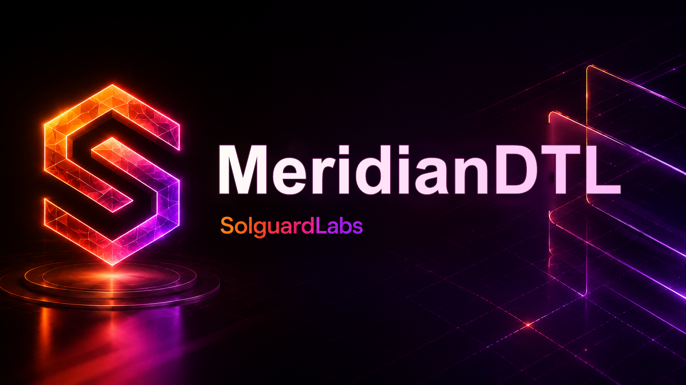

# Meridian DTL



Meridian DTL es un motor determinista de liquidacion escrito en C para rutas
multi-hop entre bovedas internas. El sistema modela intenciones firmadas,
reservas, compactacion de rutas, receipts operativos y settlements por epoch
sobre un ledger local con conservacion de suministro.

El proyecto esta disenado como una implementacion compacta de referencia para
validar flujos de liquidacion DTL en integraciones donde el plan operativo puede
derivarse a partir de una intencion de pago y de lanes internas de liquidez.

## Caracteristicas principales

- Motor C sin dependencias externas.
- Intenciones firmadas con dominio de autorizacion estable.
- Ledger con cuentas, bovedas internas, lanes de settlement y reservas.
- Rutas multi-hop con compactacion determinista antes de liquidacion.
- Receipts por epoch para registrar importe neto, cargos y digest de ruta.
- Comprobacion de conservacion despues de cada transicion critica.
- Salida JSON estable para escenarios de integracion.
- Tests JavaScript sobre la interfaz publica del ejecutable.

## Arquitectura

El codigo esta organizado por dominios funcionales:

- `include/meridian`: API publica interna del motor.
- `src/amount.c`: operaciones de importes y basis points.
- `src/codec.c`: serializacion canonica para digests y firmas.
- `src/digest.c`: digests deterministas de 32 bytes representados en hex.
- `src/crypto.c`: identidades y autenticadores deterministas de escenario.
- `src/ledger.c`: estado contable, cuentas, bovedas, lanes y journal.
- `src/route.c`: planes multi-hop, compactacion y calculo de cargos.
- `src/intent.c`: intenciones firmadas, reservas y receipts.
- `src/runtime.c`: escenarios reproducibles y reportes JSON.
- `src/main.c`: CLI del motor.

## Flujo de liquidacion

1. El ledger se inicializa con un `network_id`, activos, cuentas y bovedas.
2. Un pagador crea una intencion con importe bruto, activo, fecha limite, nonce
   y restricciones operativas.
3. La intencion se firma dentro del dominio `meridian-intent-v1`.
4. El ledger reserva el importe bruto y registra el plan operativo observado.
5. El operador ejecuta la ruta en una epoch concreta y emite un receipt.
6. Antes de liquidar, el motor compacta hops compatibles para reducir ruido
   operativo en el journal.
7. El settlement acredita beneficiario, operador y reserva de lane segun el
   plan resultante, y valida conservacion.

## Escenarios disponibles

El ejecutable acepta un argumento opcional de escenario. Si no se indica ninguno,
ejecuta `routed`.

```bash
./build/meridiandtl direct
./build/meridiandtl routed
./build/meridiandtl epoch-batch
./build/meridiandtl recompact
./build/meridiandtl rejections
./build/meridiandtl operations
```

Cada escenario emite un reporte JSON con campos estables:

- `scenario`: nombre del escenario.
- `network_id`: identificador de red.
- `asset`: activo liquidado.
- `state_digest`: digest final del ledger.
- `conservation_ok`: resultado de la comprobacion contable.
- `balances`: saldos finales por rol.
- `vaults`: balances de bovedas internas.
- `receipt`: resumen del receipt principal cuando aplica.
- `journal`: eventos contables relevantes.

## Requisitos

- Compilador C compatible con C11 (`gcc`, `clang` o `cc`).
- `make`.
- Node.js `24` o superior para tests JavaScript.

En Windows, los scripts estan preparados para ejecutarse desde Git Bash o WSL.
Si el compilador C esta en WSL y Node.js esta en Windows, usa los scripts
PowerShell incluidos.

## Instalacion

```bash
bash scripts/build.sh
```

## Comandos de desarrollo

```bash
bash scripts/build.sh    # compila el motor C
bash scripts/tests.sh    # build y tests JavaScript
bash scripts/ci.sh       # pipeline local completo
node --test --test-concurrency=1 "tests/node/*.test.js"
make clean
```

En Windows con WSL:

```powershell
powershell -ExecutionPolicy Bypass -File scripts/tests.ps1
powershell -ExecutionPolicy Bypass -File scripts/ci.ps1
```

Si se instala la dependencia de formato opcional:

```bash
npm install
npm run fmt:check
```

## Calidad y CI

El workflow de GitHub Actions ejecuta:

- instalacion de toolchain C y Node;
- compilacion con `-Wall -Wextra -Werror -pedantic`;
- ejecucion de escenarios desde el binario;
- tests JavaScript con `node:test`;
- verificacion de sintaxis JavaScript.

Dependabot revisa GitHub Actions y dependencias npm semanales.

## Estado del proyecto

Meridian DTL es una implementacion de referencia para entornos de revision y no
debe tratarse como infraestructura lista para produccion sin auditoria externa,
modelado formal de invariantes y validacion de integracion especifica.
